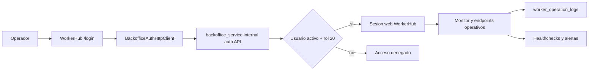

1) General

- Titulo: Autenticacion operativa de WorkerHub contra backoffice_service
- Tipo: Feature
- Propietarios: Backend
- Enlaces: Jira SMWH

2) Resumen

- WorkerHub deja de depender de listas locales de correos como mecanismo principal de acceso.
- El panel operativo y los endpoints de monitoreo usan login propio con sesion Laravel.
- La autorizacion real se valida por API contra `backoffice_service`.
- Solo usuarios con rol administrador configurado en backoffice (`admin_role_id = 20`) pueden entrar.
- El token tecnico se mantiene solo como fallback operativo controlado.

3) Logica de negocio

- WorkerHub no consulta tablas del backoffice directamente.
- La fuente de verdad para autorizacion de operadores es `backoffice_service`.
- Un login valido debe cumplir cuatro condiciones: credenciales validas, usuario activo, respuesta alcanzable de backoffice y rol administrador permitido.
- Si backoffice no responde, WorkerHub niega acceso.
- El token tecnico no reemplaza la autorizacion normal; queda solo para soporte o automatizacion.

4) Alcance

- En el alcance
- login y logout web en WorkerHub
- sesion minima de operador
- cliente HTTP interno hacia backoffice
- endpoint interno de autorizacion en `backoffice_service`
- healthchecks de dependencias criticas
- auditoria de login, logout, denegaciones y fallback por token
- Fuera de alcance
- SSO corporativo
- 2FA propio dentro de WorkerHub
- federacion entre multiples proveedores de identidad
- Asunciones
- `backoffice_service` es accesible desde WorkerHub por red interna
- `BACKOFFICE_SHARED_TOKEN` se configura en ambos servicios

5) Usuarios e impacto

- Quien: operadores internos y administradores de integraciones
- Cambios visibles para el usuario:
- existe una pantalla `/login`
- el panel web usa sesion propia
- operadores no autorizados reciben rechazo explicito

6) Arquitectura y diseno

- Flujo general
- operador abre `WorkerHub`
- WorkerHub solicita credenciales
- WorkerHub llama a `backoffice_service`
- backoffice valida usuario activo y rol administrador
- WorkerHub crea sesion local minima y habilita el monitor
- Componentes y servicios clave:
- `WorkerHubSessionController`
- `EnsureWorkerHubOperatorAccess`
- `BackofficeAuthClientInterface`
- `BackofficeAuthHttpClient`
- `WorkerHubOperatorSessionManager`
- `WorkerHubHealthService`
- `WorkerHubOperatorAuthController` en `backoffice_service`
- Flujo de datos
- navegador -> WorkerHub login -> backoffice auth API -> sesion local -> monitor/API operativa

7) Backend

- Servicios/modulos modificados
- `WorkerHub`:
- auth web
- middleware de acceso
- health operacional
- Docker healthchecks
- `backoffice_service`:
- endpoint interno `POST /api/internal/workerhub/operators/authenticate`
- endpoint interno `GET /api/internal/workerhub/operators/health`
- Casos de error y soluciones
- backoffice no disponible: login rechazado y health degradado
- credenciales invalidas: login rechazado
- usuario sin rol 20: login denegado
- token fallback invalido: acceso denegado

10) base de datos y migraciones

- Esquema/Campos modificados
- no se agregaron tablas nuevas para esta entrega
- La auditoria sigue usando `worker_operation_logs`
- Estrategia para rollback
- revertir codigo de auth web y volver temporalmente al token tecnico

12) Pruebas

- Pruebas unitarias:
- cliente HTTP de backoffice
- health degradado por dependencia remota
- Pruebas feature:
- login exitoso de operador autorizado
- rechazo por rol invalido
- logout
- redireccion a login sin sesion
- fallback por token
- Como verificar manualmente:
- configurar `BACKOFFICE_BASE_URL` y `BACKOFFICE_SHARED_TOKEN`
- abrir `/login`
- autenticar con un usuario administrador del backoffice
- entrar al monitor y ejecutar una accion operativa
- validar filas `auth.login.success` y `monitor.view` en `worker_operation_logs`
- desconectar backoffice y comprobar `GET /api/health/workerhub`

13) Despliegue y puesta en marcha

- Ambientes
- local
- docker
- productivo interno
- Config/variables de entorno
- `BACKOFFICE_BASE_URL`
- `BACKOFFICE_AUTH_ENDPOINT`
- `BACKOFFICE_HEALTH_ENDPOINT`
- `BACKOFFICE_AUTH_TIMEOUT`
- `BACKOFFICE_ADMIN_ROLE_ID`
- `BACKOFFICE_SHARED_TOKEN`
- `WORKERHUB_ALLOW_TOKEN_FALLBACK`
- `WORKERHUB_ALLOW_LOCAL_BYPASS`
- `WORKERHUB_DEAD_LETTERS_ALERT_THRESHOLD`
- Plan de difusion
- activar primero en ambiente interno
- validar login operativo y healthchecks
- desactivar bypass local en ambientes no locales

14) Monitoreo y alertas

- Logs
- `auth.login.success`
- `auth.login.failed`
- `auth.login.denied`
- `auth.logout`
- `auth.access.denied`
- `auth.token_fallback.used`
- Alertas
- backoffice auth degradado
- SQL Server degradado
- dead letters sobre umbral
- Kafka sin configuracion valida

15) Riesgos y mitigaciones

- Riesgo: `backoffice_service` no expone el endpoint interno esperado
- Mitigacion: el contrato queda versionado y documentado en ambos servicios
- Riesgo: se deja activo el bypass local en ambientes no locales
- Mitigacion: fijar `WORKERHUB_ALLOW_LOCAL_BYPASS=false` fuera de desarrollo
- Riesgo: uso excesivo del token fallback
- Mitigacion: auditar `auth.token_fallback.used` y tratarlo como acceso excepcional

16) Diagrama de flujo

