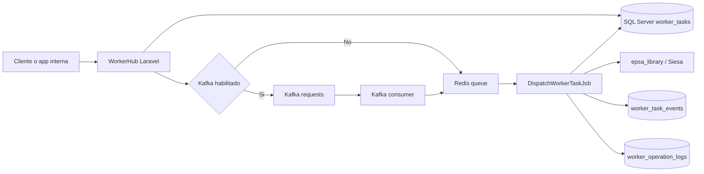

1) General

- Titulo: Cierre end-to-end de WorkerHub en desarrollo
- Tipo: Feature
- Propietarios: Backend
- Enlaces: Jira `SMWH`

2) Resumen

- Se cerro la validacion local completa de `WorkerHub` sobre `5010` con autenticacion real contra `backoffice_service`.
- Se agrego un fallback controlado `direct_queue` para desarrollo cuando Kafka no esta disponible localmente.
- Se corrigio el acceso por sesion web a `/api/monitor/*`, no solo al panel `/monitor`.
- Se endurecio el ciclo de fallo del job para marcar `failed` y publicar DLQ aun si Laravel no ejecuta el callback `failed()` en el punto esperado.
- Se valido el flujo `create -> queued -> processing -> failed -> retry -> lineage` usando Redis real y `epsa_library`.

3) Logica de negocio

- En produccion, `WorkerHub` sigue priorizando Kafka como bus central de tareas.
- En desarrollo, si `KAFKA_PUBLISH_ENABLED=false` y `WORKERHUB_KAFKA_DIRECT_DISPATCH_FALLBACK=true`, la solicitud entra por Laravel y se encola directamente en Redis.
- El monitor debe funcionar con sesion web validada por `backoffice_service`, no solo con token tecnico.
- Las tareas fallidas deben quedar marcadas como `failed`, registrar evento, persistir error y permitir replay manual.

4) Alcance

- En el alcance
- Validacion de login real con rol `20` desde backoffice
- Healthcheck operativo en estado `ok`
- Encolado directo a Redis para desarrollo sin Kafka local
- Procesamiento real de jobs con `queue:work`
- Fallo controlado con `epsa_library` sin configuracion SOAP real
- Replay manual y lineage padre/hijo
- Fuera de alcance
- Levantar Kafka/Redpanda real en esta maquina
- Validar una importacion Siesa exitosa con credenciales productivas
- Asunciones
- `backoffice_service` esta disponible localmente en `5011`
- Redis local esta disponible en `127.0.0.1:6379`

5) Usuarios e impacto

- Quien: backend, integraciones internas, soporte operativo
- Cambios visibles para el usuario:
- acceso web y API de monitor con la misma sesion validada por backoffice
- visibilidad clara del modo de despacho en healthcheck

6) Arquitectura y diseno

- Flujo general
- `WorkerHub` recibe la tarea HTTP
- si Kafka esta habilitado, publica en `workerhub.tasks.requests`
- si Kafka esta deshabilitado en desarrollo, usa `direct_queue` hacia Redis
- `DispatchWorkerTaskJob` procesa, registra resultado o fallo y actualiza el monitor
- Componentes y servicios clave:
- `WorkerTaskDispatchService`
- `KafkaMessageProducer`
- `DispatchWorkerTaskJob`
- `EnsureWorkerHubOperatorAccess`
- `WorkerHubHealthService`
- Flujo de datos (fuente-> procesamiento-> almacenamiento -> consumidores)
- cliente -> Laravel -> SQL Server `worker_tasks`
- Laravel -> Redis queue -> `DispatchWorkerTaskJob`
- job -> `epsa_library`
- job -> SQL Server `worker_task_events` + `worker_operation_logs`

7) Backend

- Servicios/modulos modificados
- `app/Services/Workers/WorkerTaskDispatchService.php`
- `app/Services/Kafka/KafkaMessageProducer.php`
- `app/Jobs/DispatchWorkerTaskJob.php`
- `app/Http/Controllers/Api/WorkerTaskController.php`
- `app/Http/Controllers/Api/DocumentMigrationController.php`
- `app/Services/Workers/WorkerTaskReplayService.php`
- `routes/api.php`
- `app/Services/Health/WorkerHubHealthService.php`
- Casos de error y soluciones
- Kafka local apagado: fallback `direct_queue`
- error de importacion SOAP/Siesa: tarea queda `failed` y disponible para replay
- acceso API monitor sin sesion: se corrige agregando middleware `web` al grupo `/api/monitor/*`

8) Frontend

- Paginas/componentes modificados
- no aplica cambio visual grande
- comportamiento UI
- el panel `/monitor` y sus llamadas a `/api/monitor/*` ya comparten la misma sesion autenticada
- Captura y manejo de estados
- el lineage muestra padre e hijos con sus estados terminales

10) base de datos y migraciones

- Esquema/Campos modificados
- sin nuevas migraciones en este cierre
- Estrategia para rollback
- revertir solo el codigo de fallback; no hay cambios de esquema asociados a este bloque

12) Pruebas

- Pruebas unitarias:
- `php vendor/bin/phpunit` -> `27` tests OK
- Como verificar manualmente:
- abrir `http://127.0.0.1:5010/login`
- autenticar contra `backoffice_service`
- ejecutar `POST /api/document-migrations`
- correr `php artisan queue:work redis --queue=migration-default --once`
- consultar `GET /api/monitor/tasks/{task_id}`
- ejecutar `POST /api/monitor/tasks/{task_id}/retry`
- consultar `GET /api/monitor/tasks/{task_id}/lineage`

13) Despliegue y puesta en marcha

- Ambientes
- desarrollo local sin Kafka real
- Config/variables de entorno (no pedir valores, solo nombres)
- `APP_PORT`
- `DB_*`
- `REDIS_*`
- `BACKOFFICE_BASE_URL`
- `BACKOFFICE_SHARED_TOKEN`
- `KAFKA_PUBLISH_ENABLED`
- `WORKERHUB_KAFKA_DIRECT_DISPATCH_FALLBACK`
- `WORKERHUB_KAFKA_SUPPRESS_PUBLISH_FAILURES`
- `EPSA_SIESA_*`
- Plan de difusion
- mantener `KAFKA_PUBLISH_ENABLED=true` en ambientes donde Kafka este operativo
- reservar `direct_queue` solo para desarrollo y contingencia controlada

14) Monitoreo y alertas

- Logs
- `worker_task_events`
- `worker_operation_logs`
- `storage/logs/laravel.log`
- Alertas
- `workerhub:healthcheck --json` ahora expone `dispatch_mode` en la seccion Kafka

15) Riesgos y mitigaciones

- Top risks + mitigation
- El fallback `direct_queue` no reemplaza Kafka en produccion
- La importacion Siesa sigue fallando mientras `EPSA_SIESA_SOAP_URL` y credenciales reales no existan
- La base usada en desarrollo sigue siendo compartida porque el usuario actual no puede crear `workerhub`

16) Diagrama de flujo

Recuerde que documentar es un proceso que está en el perfil de desarrollador
