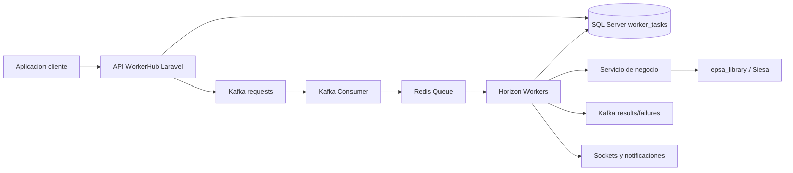

1) General

- Titulo: WorkerHub como centralizador de tareas asincronas con Kafka, Horizon y monitoreo Laravel
- Tipo: Feature
- Propietarios: Backend
- Enlaces: N/A

2) Resumen

- Se agrego una puerta de entrada HTTP en Laravel para registrar y publicar tareas a Kafka.
- Se agrego un consumidor Kafka que transforma mensajes en jobs Redis para Horizon.
- Se agrego monitoreo persistente de tareas y eventos en base de datos.
- Se agregaron notificaciones internas/email para tareas fallidas y opcionalmente completadas.
- Se dockerizo el proyecto con Nginx, dos instancias PHP, Redpanda, Redis, Echo Server, Horizon y scheduler conectando a SQL Server externo.
- Se agrego una consola operativa web con replay manual y bandeja logica de DLQ.
- Se agrego replay por lote, topic Kafka dedicado para dead letters y middleware de proteccion operativa.
- Se agrego auditoria persistente de acciones operativas y export JSON de dead letters.
- Se agregaron filtros operativos extendidos, export de tareas/auditoria, retry filtrado y lineage de replays.
- Se agrego autenticacion productiva en WorkerHub delegada a `backoffice_service` con sesion web propia y fallback tecnico auditado.
- Se agregaron healthchecks operativos para SQL Server, Redis, Kafka, backoffice auth y umbral de dead letters.

3) Logica de negocio

- Toda tarea debe entrar primero por WorkerHub antes de ser publicada a Kafka.
- WorkerHub registra la trazabilidad antes de publicar la tarea.
- Kafka es el bus central de tareas entre aplicaciones.
- Horizon toma los jobs desde Redis y ajusta procesos por demanda.
- Los cambios de estado de una tarea se registran en `worker_tasks` y `worker_task_events`.
- Las tareas fallidas pueden disparar notificaciones a usuarios internos y/o emails configurados.
- Los cambios de estado tambien se emiten por sockets para monitores en tiempo real.
- Las tareas `failed` y `rejected` pueden reencolarse manualmente preservando trazabilidad padre-hijo.
- Los rechazos y fallos terminales se publican tambien en el topic de dead letters.
- Toda accion operativa relevante sobre el monitor queda auditada en `worker_operation_logs`.
- Las operaciones batch deben respetar el conjunto filtrado actual del monitor.
- La trazabilidad de replay se conserva via `parent_task_id` y se expone como lineage.
- El acceso principal al monitor requiere validacion remota contra `backoffice_service`.
- Solo usuarios activos con rol administrador configurado (`20` por default) pueden abrir sesion.

4) Alcance

- En el alcance
- Recepcion HTTP de tareas
- Publicacion a Kafka
- Consumo Kafka
- Encolamiento en Redis
- Ejecucion de jobs
- Monitor de tareas
- Notificaciones por estado
- Dockerizacion base
- Replay manual
- DLQ logica
- Replay por lote
- Proteccion operativa
- Documentacion tecnica y API docs
- Fuera de alcance
- Escalado automatico de contenedores
- Dashboard frontend dedicado
- SLAs y politicas de reintento por cada dominio de negocio
- Asunciones
- `document_migration` es el primer tipo de tarea soportado
- `epsa_library` ya esta instalada y resoluble en Laravel

5) Usuarios e impacto

- Quien: equipos backend e integraciones internas
- Cambios visibles para el usuario: nuevos endpoints para encolar y consultar tareas; Horizon disponible como panel operativo

6) Arquitectura y diseno

- Flujo general
- Laravel recibe tarea, la registra y la publica en Kafka
- Kafka consumer recibe, valida y encola en Redis
- Horizon ejecuta y balancea workers por demanda
- El monitor registra transiciones y resultados
- Componentes y servicios clave:
- `WorkerTaskController`
- `DocumentMigrationController`
- `WorkerTaskConsumer`
- `DispatchWorkerTaskJob`
- `WorkerTaskMonitorService`
- `WorkerTaskNotificationService`
- `WorkerTaskReplayService`
- `DocumentMigrationService`
- `WorkerOperationsDashboardController`
- `WorkerOperationLogService`
- `MonitorTaskFilters`
- `OperationLogFilters`
- `EnsureWorkerHubOperatorAccess`
- `BackofficeAuthHttpClient`
- `WorkerHubSessionController`
- `WorkerHubOperatorSessionManager`
- `WorkerHubHealthService`
- Flujo de datos (fuente-> procesamiento-> almacenamiento -> consumidores)
- Cliente -> API Laravel -> Kafka -> Redis/Horizon -> servicio de negocio -> SQL Server + Kafka results/failures + sockets + notificaciones
- Operador -> WorkerHub login -> backoffice_service -> sesion web -> monitor operativo

7) Backend

- Servicios/modulos modificados
- API de tareas y monitoreo
- Consumer Kafka
- Job de despacho
- Servicios de monitoreo y notificaciones
- Servicio de replay operativo
- Servicio de auditoria operativa
- Objetos de filtros reutilizables para monitor y auditoria
- Docker stack
- Broadcasting por sockets
- Publicacion Kafka a dead letters
- Login web propio con validacion remota de operadores
- Healthchecks operativos y comando `workerhub:healthcheck`
- Casos de error y soluciones
- Mensaje Kafka invalido: se marca como rechazado y se publica evento de fallo
- Fallo de negocio en job: se marca fallido y se notifica
- Falla de importacion Siesa: se encapsula como error de tarea

10) base de datos y migraciones

- Esquema/Campos modificados
- `worker_tasks`
- `worker_task_events`
- `notifications`
- `worker_operation_logs`
- Campos nuevos
- `parent_task_id`
- `replayed_at`
- Indices
- `status` en `worker_tasks`
- `worker_task_id` en `worker_task_events`
- Estrategia para rollback
- revertir migraciones en orden inverso y detener consumidores antes del rollback

12) Pruebas

- Pruebas unitarias:
- monitor de tareas
- notificacion por fallo
- ingreso de tarea y resumen del monitor
- export de dead letters
- auditoria de operaciones
- retry filtrado
- lineage de replays
- Como verificar manualmente:
- publicar una tarea en `/api/worker-tasks`
- validar registro en `worker_tasks`
- validar encolamiento y ejecucion
- revisar `/api/monitor/tasks`
- suscribirse al canal `workerhub.monitor`
- reencolar una tarea terminal desde `/api/monitor/tasks/{taskId}/retry`
- reencolar varias tareas desde `/api/monitor/tasks/retry-batch`
- exportar dead letters desde `/api/monitor/dead-letters/export`
- revisar historial reciente desde `/api/monitor/actions`
- exportar tareas desde `/api/monitor/tasks/export`
- exportar auditoria desde `/api/monitor/actions/export`
- ejecutar retry filtrado desde `/api/monitor/tasks/retry-filtered`
- revisar lineage desde `/api/monitor/tasks/{taskId}/lineage`

13) Despliegue y puesta en marcha

- Ambientes
- local docker
- Config/variables de entorno (no pedir valores, solo nombres)
- `DB_*`
- `REDIS_*`
- `KAFKA_*`
- `WORKERHUB_*`
- `EPSA_SIESA_*`
- `HORIZON_ALLOWED_EMAILS`
- `PUSHER_*`
- `WORKERHUB_OPERATIONS_TOKEN`
- `WORKERHUB_ALLOW_TOKEN_FALLBACK`
- `WORKERHUB_ALLOW_LOCAL_BYPASS`
- `WORKERHUB_DEAD_LETTERS_ALERT_THRESHOLD`
- `BACKOFFICE_BASE_URL`
- `BACKOFFICE_AUTH_ENDPOINT`
- `BACKOFFICE_HEALTH_ENDPOINT`
- `BACKOFFICE_AUTH_TIMEOUT`
- `BACKOFFICE_ADMIN_ROLE_ID`
- `BACKOFFICE_SHARED_TOKEN`
- Plan de difusion
- habilitar primero en ambiente interno y luego conectar aplicaciones productoras

14) Monitoreo y alertas

- Logs
- logs de Laravel y eventos por tarea
- Alertas
- notificaciones configurables para fallos y opcionalmente completados
- Tiempo real
- eventos `worker-task.updated` via `echo-server`
- Operacion
- replay manual desde panel web y API
- Seguridad
- middleware de operador para panel y endpoints de monitoreo
- health endpoint con degradacion por dependencias criticas
- auditoria de login, logout, denegaciones y uso de token fallback

15) Riesgos y mitigaciones

- Top risks + mitigation
- Kafka disponible pero Redis caido: la tarea se rechaza y queda trazabilidad en DB
- SQL Server caido: no hay monitor persistente; se debe tratar como dependencia critica
- Docker Compose no escala contenedores solo: usar Horizon ahora y KEDA/Kubernetes despues
- La DLQ operativa se consulta desde base de datos y los eventos terminales tambien se publican al topic Kafka dedicado de dead letters

16) Diagrama de flujo

