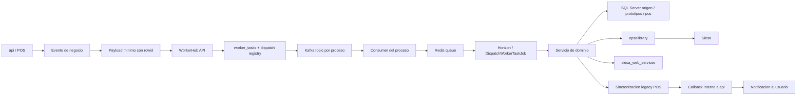
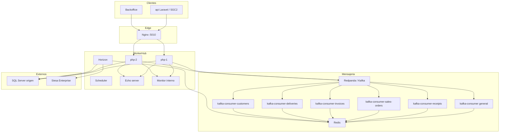

# Sistema de migraciones a WorkerHub

## 1. Objetivo

Centralizar en `WorkerHub` la ejecucion real de los procesos legacy de integracion documental entre POS y Siesa, manteniendo:

- idempotencia por documento y tipo de evento
- auditoria XML y de resultado
- sincronizacion de estado legacy en POS
- separacion por proceso en colas y topics
- recuperacion operativa desde `api`

---

## 2. Vista rapida

| Proceso | Origen | Ejecuta importacion/anulacion real | Estado actual |
|---|---|---:|---|
| `receipt_migration` | `api` | `WorkerHub` | Integrado |
| `order_migration` | `api` | `WorkerHub` | Integrado |
| `invoice_migration` | `api` | `WorkerHub` | Integrado |
| `receipt_cancellation` | `api` | `WorkerHub` | Integrado |
| `order_cancellation` | `api` / `WorkerHub` | Mixto segun estado | Integrado |
| `order_delivery_generation` | `WorkerHub` follow-up | `WorkerHub` | Integrado |

### Regla de oro

`api` ya no debe resolver la estructura completa del documento.  
`api` envia el `rowid` y el contexto minimo.  
`WorkerHub` resuelve el documento real y ejecuta la logica legacy.

---

## 3. Procesos integrados

### 3.1 Recibos

#### `receipt_migration`

Responsabilidades:

- resolver recibo desde `receipt_id`
- validar precondiciones legacy
- sincronizar tercero/sucursal cuando aplica
- validar cruces/cartera
- construir lineas de importacion
- importar a Siesa
- auditar en `siesa_web_services`
- sincronizar `pos.recibos_encabezado`
- escribir `pos.recibos_historia_migracion`

#### `receipt_cancellation`

Responsabilidades:

- validar estado actual en Siesa
- si ya esta anulado, cerrar idempotente y sincronizar legacy
- si aun no esta anulado, reenviar anulacion legacy
- sincronizar indicadores de anulacion en POS

### 3.2 Pedidos

#### `order_migration`

Responsabilidades:

- resolver pedido desde `order_id`
- recalcular estado legacy antes de importar
- sincronizar tercero/sucursal
- convertir soporte de pago si aplica
- construir lineas de pedido
- importar a Siesa
- auditar XML y resultado
- sincronizar `pos.pedidos_encabezado`
- escribir `pos.pedidos_historia_migracion`
- disparar `order_delivery_generation` cuando la migracion termina correctamente

#### `order_cancellation`

Responsabilidades:

- si el pedido no existe en Siesa ni esta migrado, `api` lo anula de inmediato
- si ya existe o fue migrado, `WorkerHub` ejecuta la anulacion real en Siesa
- si esta comprometido, primero descompromete
- si ya esta anulado, cierra idempotente
- preserva bitacoras del domicilio como notas del pedido antes del desligue
- sincroniza legacy en POS

#### `order_delivery_generation`

Responsabilidades:

- correr como follow-up de `order_migration`
- validar si el estado Siesa permite crear domicilio
- reutilizar domicilio de obsequio cuando aplica
- crear domicilio nuevo cuando corresponda
- actualizar `PE_DomicilioTipo` y `PE_DomicilioNumero`

### 3.3 Facturas

#### `invoice_migration`

Responsabilidades:

- resolver factura desde `invoice_id`
- completar `FE_CuentaPorCobrar` y `FE_ClaseDeCliente` si faltan
- sincronizar tercero/sucursal cuando aplica
- convertir credito `001` a contado si hay medios de pago suficientes
- construir lineas de encabezado, pagos/CxC, detalle, IVA, INC y descuentos
- probar secuencia interna de ajustes de caja antes de declarar falla
- importar a Siesa
- auditar cada intento XML
- sincronizar `pos.facturas_encabezado`
- escribir `pos.facturas_historia_migracion`

**Importante sobre facturas:**  
la anulacion **no** hace parte de este alcance. Solo se integra la importacion.

---

## 4. Contratos entre `api` y `WorkerHub`

### 4.1 Payloads minimos

| Evento | Campo fuente de verdad |
|---|---|
| Recibo | `receipt_id` |
| Pedido | `order_id` |
| Factura | `invoice_id` |

Campos base comunes:

- `db_connection`
- `company_id`
- `created_by_user_id`
- `source`
- `priority`
- metadatos operativos del monitor

### 4.2 Endpoints publicos de `WorkerHub`

| Endpoint | Tipo |
|---|---|
| `POST /api/receipt-migrations` | Migracion |
| `POST /api/order-migrations` | Migracion |
| `POST /api/invoice-migrations` | Migracion |
| `POST /api/receipt-cancellations` | Anulacion |
| `POST /api/order-cancellations` | Anulacion |

### 4.3 Callbacks de `WorkerHub` hacia `api`

| Endpoint interno | Evento |
|---|---|
| `POST /api/internal/workerhub/receipts/migrated` | Recibo migrado |
| `POST /api/internal/workerhub/orders/migrated` | Pedido migrado |
| `POST /api/internal/workerhub/invoices/migrated` | Factura migrada |
| `POST /api/internal/workerhub/receipts/cancelled` | Recibo anulado |
| `POST /api/internal/workerhub/orders/cancelled` | Pedido anulado |

---

## 5. Flujo operativo de alto nivel

---

## 6. Componentes clave

### 6.1 `api`

| Componente | Responsabilidad |
|---|---|
| `WorkerHubClient` | Invocar endpoints de `WorkerHub` |
| `ReceiptMigrationPayloadFactory` | Crear payload minimo de recibo |
| `OrderMigrationPayloadFactory` | Crear payload minimo de pedido |
| `InvoiceMigrationPayloadFactory` | Crear payload minimo de factura |
| listeners de negocio | Disparar dispatch a `WorkerHub` |
| recovery commands | Reenviar pedidos/recibos no aceptados |

### 6.2 `WorkerHub`

| Componente | Responsabilidad |
|---|---|
| `WorkerTaskDispatchRegistryService` | Evitar reenvio duplicado |
| `SiesaImportAuditService` | Guardar XML y resultado en `siesa_web_services` |
| `DocumentImportAttemptControlService` | Actualizar `control_importacion_documentos` |
| `ReceiptMigrationService` | Migrar recibos |
| `OrderMigrationService` | Migrar pedidos |
| `InvoiceMigrationService` | Migrar facturas |
| `ReceiptCancellationService` | Anular recibos |
| `OrderCancellationService` | Anular pedidos |
| `OrderDeliveryGenerationService` | Crear domicilio post migracion |

---

## 7. Topics Kafka, consumers y colas

### 7.1 Topics por proceso

| Proceso | Topic request |
|---|---|
| recibos | `workerhub.tasks.requests.receipts` |
| pedidos | `workerhub.tasks.requests.sales_orders` |
| facturas | `workerhub.tasks.requests.invoices` |
| domicilios | `workerhub.tasks.requests.deliveries` |
| clientes | `workerhub.tasks.requests.customers` |

Topics transversales:

- `workerhub.tasks.results`
- `workerhub.tasks.failures`
- `workerhub.tasks.dead_letters`

### 7.2 Consumers dedicados

| Consumer | Grupo |
|---|---|
| `kafka-consumer-receipts` | `workerhub-task-consumers-receipts` |
| `kafka-consumer-sales-orders` | `workerhub-task-consumers-sales-orders` |
| `kafka-consumer-invoices` | `workerhub-task-consumers-invoices` |
| `kafka-consumer-deliveries` | `workerhub-task-consumers-deliveries` |
| `kafka-consumer-customers` | `workerhub-task-consumers-customers` |

### 7.3 Colas Horizon

| Cola | Uso |
|---|---|
| `receipts-default` / `receipts-high` | Recibos |
| `sales-orders-default` / `sales-orders-high` | Pedidos |
| `invoices-default` / `invoices-high` | Facturas |
| `deliveries-default` / `deliveries-high` | Domicilios |
| `customers-default` / `customers-high` | Clientes |
| `general-default` / `general-high` | Flujo general |
| `integration` | Integraciones auxiliares |

---

## 8. Tabla de control de importaciones

### 8.1 Responsabilidad

La tabla legacy `pos.control_importacion_documentos` se actualiza desde `WorkerHub`, no desde `api`, porque `WorkerHub` es quien hace el intento real.

### 8.2 Semantica actual

| Tipo | Momento de registro |
|---|---|
| Pedido | justo antes del `import()` real |
| Recibo | justo antes del `import()` real |
| Cliente de pedido/recibo/factura | cuando el `customer_sync` queda `prepared` |
| Factura | **solo despues de agotar toda la secuencia interna de ajustes y fallar** |

### 8.3 Cambio importante en facturas

Antes, el intento de factura se consumia para escoger un solo ajuste por corrida.  
Ahora, dentro de una misma ejecucion de `invoice_migration`, `WorkerHub` recorre internamente la secuencia completa de ajustes de caja y **solo si todos fallan** incrementa `DC_intentos`.

Eso deja esta semantica:

1. Se prepara el cliente si hace falta.
2. Se calculan todos los ajustes de caja candidatos.
3. Se intenta la importacion varias veces dentro del mismo task.
4. Si alguna importa bien, no se incrementa `DC_intentos` de la factura.
5. Si todas fallan, se incrementa una sola vez el intento legacy de factura.

### 8.4 Secuencia interna de ajustes de caja para facturas

Cuando la factura es de contado, `WorkerHub` prueba:

1. diferencia legacy entre total recalculado del detalle y total de pagos
2. ajuste redondeado legacy
3. secuencia alternante: `0, +1, -1, +2, -2, ..., +10, -10`

Los valores se desduplican antes de ejecutar la secuencia.

---

## 9. Base de datos impactada

### 9.1 Tablas legacy POS

| Dominio | Tablas |
|---|---|
| Recibos | `pos.recibos_encabezado`, `pos.recibos_historia_migracion` |
| Pedidos | `pos.pedidos_encabezado`, `pos.pedidos_historia_migracion`, `ventas.pedidos_cadenas` |
| Facturas | `pos.facturas_encabezado`, `pos.facturas_historia_migracion`, `pos.facturas_pagos`, `pos.facturas_cufe` |
| Control | `pos.control_importacion_documentos` |
| Notas | `pos.notas_pedidos` |
| Domicilios | `logistica.domicilios_*` |
| Bitacoras | `aplicacion.bitacora_movimientos` |

### 9.2 Tablas de monitor y auditoria `WorkerHub`

| Tabla | Uso |
|---|---|
| `worker_tasks` | estado de la tarea |
| `worker_task_events` | eventos de la tarea |
| `worker_task_dispatch_registries` | accepted dispatch idempotente |
| `siesa_web_services` | XML, contexto y resultado de importacion |

---

## 10. Infraestructura real de `WorkerHub`

### 10.1 Servicios principales del stack

| Servicio | Rol |
|---|---|
| `nginx` | entrada HTTP |
| `php-1`, `php-2` | app Laravel |
| `horizon` | ejecucion de colas |
| `scheduler` | tareas programadas internas |
| `redpanda` | Kafka |
| `redis` | colas y cache |
| `echo-server` | broadcasting |
| consumers dedicados | consumo por topic de proceso |

### 10.2 Politica operativa

- `restart: unless-stopped`
- `healthcheck` por contenedor critico
- `migrate --force` en runtime donde aplica
- consumers separados por topic y grupo

### 10.3 Diagrama de infraestructura

---

## 11. Recovery y operacion

### 11.1 Recovery en `api`

Comandos:

- `workerhub:recover-receipt-migrations`
- `workerhub:recover-order-migrations`

Politica:

- corren cada 5 minutos
- toman documentos del dia
- filtran no migrados
- filtran no existentes en Siesa
- consultan si `WorkerHub` ya acepto el dispatch
- reenvian solo los faltantes

### 11.2 Health operativo

Revisar:

- `worker_tasks` en `published`, `queued`, `processing`, `failed`
- `dead letters`
- estado de consumers dedicados
- `siesa_web_services`
- callbacks a `api`

---

## 12. Validacion manual recomendada

### Recibo

Checklist:

- crear recibo POS
- validar dispatch `receipt_migration`
- validar tercero/sucursal si aplica
- validar `siesa_web_services`
- validar `RE_IndicadorMigrado = 1`
- validar `RE_EstadoVerificadoExportacion = 2`

### Pedido

Checklist:

- aprobar pedido POS
- validar dispatch `order_migration`
- validar `siesa_web_services`
- validar `PE_IndicadorMigrado = 1`
- validar follow-up `order_delivery_generation`
- validar `PE_DomicilioTipo` y `PE_DomicilioNumero`

### Factura

Checklist:

- crear factura POS
- validar dispatch `invoice_migration`
- validar preparacion de `FE_CuentaPorCobrar` y `FE_ClaseDeCliente` si faltaban
- validar secuencia interna de ajustes de caja si es contado
- validar que el intento legacy de factura solo suba si todos los ajustes fallan
- validar `FE_IndicadorMigrado = 1`
- validar `FE_EstadoVerificadoExportacion = 2`

### Anulaciones

Checklist:

- anular recibo migrado
- anular pedido no migrado
- anular pedido migrado
- validar sincronizacion legacy y notificaciones

---

## 13. Riesgos y mitigaciones

| Riesgo | Mitigacion |
|---|---|
| Documento ya existe en Siesa pero SOAP responde error | verificacion posterior y cierre idempotente |
| Duplicidad de consumo Kafka | topics y grupos separados por proceso |
| Payload redundante/inconsistente | `rowid` como fuente de verdad |
| Factura con desalineacion de caja | secuencia interna completa de ajustes antes de declarar falla |
| Perdida de bitacoras al anular pedido con domicilio | preservacion previa en `pos.notas_pedidos` |
| WorkerHub caido y documentos sin entregar | recovery commands desde `api` |

---

## 14. Estado actual para pruebas

### Puedes probar hoy

- migracion de recibos
- migracion de pedidos
- migracion de facturas
- generacion de domicilio post pedido
- anulacion de recibos
- anulacion de pedidos

### Condiciones previas

- `api` desplegada con payloads minimos
- `WorkerHub` desplegado con consumers por proceso
- `redpanda`, `redis`, `horizon`, `echo-server` y callbacks operativos
- SQL Server y Siesa accesibles desde `WorkerHub`

### Nota sobre facturas

La logica de ajustes fue modificada para que el control de intentos de factura represente una **falla global del ciclo**, no cada reajuste interno de pesos.

