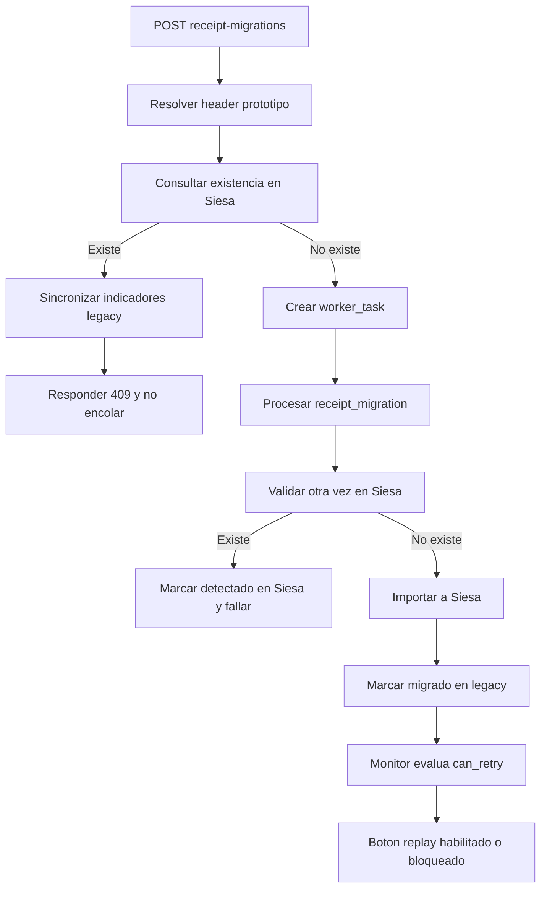

# WorkerHub: idempotencia de recibos y bloqueo de reencolado

1) General

- Titulo: WorkerHub - control de idempotencia en `receipt_migration`
- Tipo: Bugfix
- Propietarios: Backend WorkerHub
- Enlaces: monitor de tareas, endpoint `POST /api/receipt-migrations`

2) Resumen

- Se agrega una validacion previa para impedir que un recibo ya existente en Siesa vuelva a encolarse.
- Se replica el comportamiento operativo del legacy para sincronizar indicadores del recibo cuando ya fue detectado o transmitido.
- Se bloquea el replay manual y filtrado en monitor cuando el recibo ya existe en Siesa.
- El monitor ahora expone una razon operativa clara cuando una tarea no puede reencolarse.

3) Logica de negocio

- Un recibo que ya exista en Siesa no debe volver a entrar a `receipt_migration`.
- Si el recibo ya existe en Siesa, el endpoint debe rechazar el enqueue y devolver contexto tecnico suficiente.
- Si una tarea fallida de recibo ya corresponde a un recibo transmitido en Siesa, no debe permitirse replay.
- Los indicadores legacy del recibo deben alinearse con el estado detectado:
  - `RE_IndicadorMigrado = 1`
  - `RE_EstadoVerificadoExportacion = 2` cuando ya existe en Siesa
  - `RE_FechaVerificacionExportacion` y `RE_CodigoUsuarioMigro` se sincronizan

4) Alcance

- En el alcance
  - Endpoint especifico de recibos
  - Endpoint generico de tareas cuando `type=receipt_migration`
  - Servicio de ejecucion de recibos
  - Monitor y replay de tareas
  - Sincronizacion de indicadores legacy sobre `pos.recibos_encabezado`
- Fuera de alcance
  - Historico legacy `RecibosHistoriaMigracion`
  - Ajustes de notificaciones
  - Cambios de XML o conectores SOAP
- Asunciones
  - El encabezado prototipo ya contiene `F350_ID_CO`, `F350_ID_TIPO_DOCTO` y `F350_CONSEC_DOCTO`
  - La conexion fuente tiene acceso de lectura a tablas Enterprise

5) Usuarios e impacto

- Quien: operadores de WorkerHub y procesos automáticos que envían `receipt_migration`
- Cambios visibles para el usuario:
  - el monitor desactiva el boton de reencolar cuando el recibo ya existe en Siesa
  - el operador ve el motivo del bloqueo y la referencia contable detectada
  - el endpoint responde `409` si el recibo ya fue transmitido

6) Arquitectura y diseno

- Flujo general
  - entrada HTTP
  - validacion de encabezado prototipo
  - consulta de existencia del recibo en Siesa
  - rechazo temprano o ejecucion normal
  - actualizacion de indicadores legacy
  - evaluacion de replay en monitor
- Componentes y servicios clave:
  - `ReceiptMigrationController`
  - `WorkerTaskController`
  - `ReceiptMigrationService`
  - `ReceiptSiesaStateService`
  - `ReceiptLegacyStateService`
  - `WorkerTaskReplayEligibilityService`
  - `WorkerTaskMonitorService`
- Flujo de datos
  - `request -> payload receipt_migration -> vista prototipo encabezado -> tablas Siesa t350/t357 -> decision enqueue/replay -> monitor`

7) Backend

- Servicios/modulos modificados
  - `app/Http/Controllers/Api/ReceiptMigrationController.php`
  - `app/Http/Controllers/Api/WorkerTaskController.php`
  - `app/Services/Workers/ReceiptMigrationService.php`
  - `app/Services/Workers/Receipts/ReceiptSiesaStateService.php`
  - `app/Services/Workers/Receipts/ReceiptLegacyStateService.php`
  - `app/Services/Workers/WorkerTaskReplayEligibilityService.php`
  - `app/Services/Workers/WorkerTaskReplayService.php`
  - `app/Services/Workers/WorkerTaskMonitorService.php`
  - `resources/views/monitor/index.blade.php`
- Casos de error y soluciones
  - recibo ya existe en Siesa: se responde `409`, no se crea tarea y se sincroniza estado legacy
  - replay sobre tarea fallida con recibo ya transmitido: se bloquea con mensaje operativo
  - payload incompleto para validar Siesa: se responde `422`

8) Base de datos y migraciones

- Esquema/Campos modificados
  - no hay migraciones nuevas
  - se actualizan campos existentes en `pos.recibos_encabezado`
- Campos impactados
  - `RE_IndicadorMigrado`
  - `RE_EstadoVerificadoExportacion`
  - `RE_IndicadorAprobadoPorCartera`
  - `RE_FechaMigracion`
  - `RE_FechaVerificacionExportacion`
  - `RE_CodigoUsuarioMigro`
- Estrategia para rollback
  - revertir deploy de WorkerHub
  - limpiar cache de configuracion
  - no requiere rollback de esquema

9) Pruebas

- Pruebas unitarias:
  - `tests/Unit/ReceiptMigrationServiceTest.php`
  - `tests/Unit/WorkerTaskReplayEligibilityServiceTest.php`
- Pruebas feature:
  - `tests/Feature/ReceiptMigrationControllerTest.php`
- Como verificar manualmente:
  - enviar un `receipt_migration` nuevo y validar respuesta `202`
  - volver a enviar el mismo recibo ya existente en Siesa y validar `409`
  - abrir la tarea fallida en monitor y confirmar que `Reencolar` queda bloqueado si el recibo ya existe
  - confirmar que el detalle del monitor muestra referencia Siesa y motivo del bloqueo

10) Despliegue y puesta en marcha

- Ambientes
  - desarrollo
  - produccion
- Config/variables de entorno
  - `WORKERHUB_RECEIPT_ENTERPRISE_ACCOUNTING_DOCUMENTS_TABLE`
  - `WORKERHUB_RECEIPT_ENTERPRISE_CASH_RECEIPTS_TABLE`
  - `WORKERHUB_RECEIPT_LEGACY_STATE_SYNC_ENABLED`
  - `WORKERHUB_RECEIPT_LEGACY_STATE_TABLE`
  - `WORKERHUB_RECEIPT_LEGACY_STATE_SERVICE_USER_ID`
- Plan de difusion
  - comunicar a operaciones que un `409` en recibos ahora significa idempotencia correcta y no error transitorio

11) Monitoreo y alertas

- Logs
  - el rechazo temprano devuelve `message` y `siesa_state`
  - el monitor expone `retry_block_reason` y `retry_inspection`
- Alertas
  - no se agregan alertas nuevas
  - los errores siguen cayendo en el ciclo normal de `failed/rejected`

12) Riesgos y mitigaciones

- Riesgo: falso positivo por query incorrecta a Siesa
  - mitigacion: se consulta primero con la referencia contable del header prototipo y se conserva fallback legacy para `RCM`
- Riesgo: mutar indicadores legacy desde rutas no deseadas
  - mitigacion: la sincronizacion solo se ejecuta en enqueue rechazado o ejecucion real, no durante la simple visualizacion del monitor
- Riesgo: operadores sigan intentando replay por UI antigua cacheada
  - mitigacion: limpiar vistas/cache al desplegar

13) Diagrama de flujo

